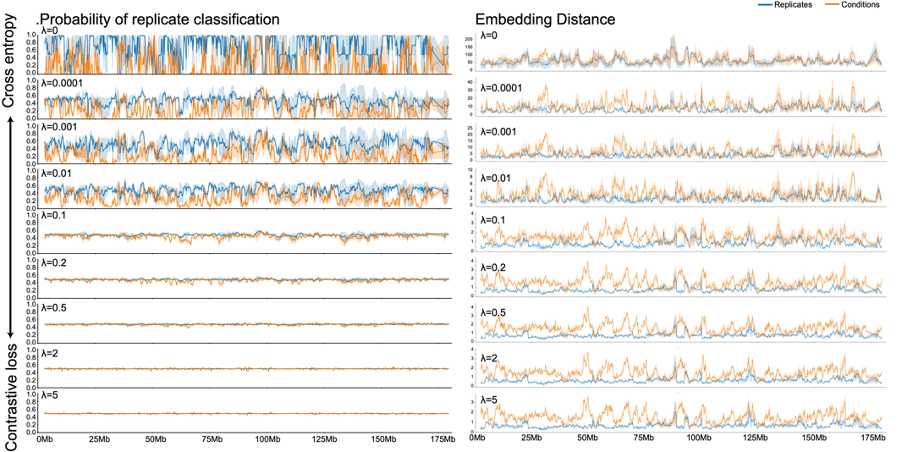
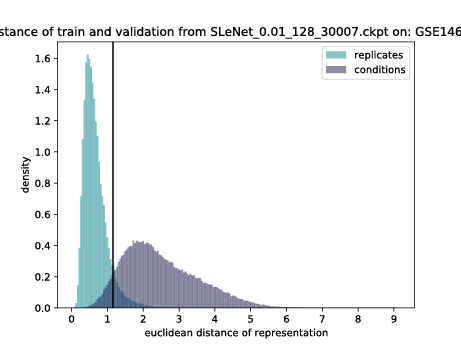

# Twins
This module contains an efficient data laoder and training structure for Hi-C data. The aim is to learn patterns from observations made along the diagonal of the Hi-C maps. This data is made up of reads which have typically been aligned, processed and normalised using either the HiCPro or the distiller pipeline. The resultant files of the format `.hic` or `.mcool` can be used as inputs for Twins. 

## Installation and Testing

### Requirements 
Python 3.6 or higher. Linux/OS. Separate installation of hic-straw is recommended (v0.0.8). Also installations of cooler (v0.8.10),  frozendict (v1.2), scipy (v1.5.2 or higher), pytorch (v1.6.0 or higher), numpy (v1.18.0 or higher) and Cython (v0.29.21). 

### Installation 
Clone repository and then inside the repository run the following command: 

``` python setup.py install ```

This should be a quick command, if dependencies need to be installed then it may take up to 15 or 20 mins. 

## Reformat Hi-C Data 
Since Twins relies on Pytorch and takes images from along the daigonal of Hi-C files, we load Hi-C and reformat them into Pytorch datasets with images taken along the Hi-C diagonal. Saving imediately after initialising is recommended since the initialisation is time and memory intensive.
 
To load Hi-C data from a `.hic` we use the HiCDatasetDec type:

```
from HiSiNet.HiCDatasetClass import HiCDatasetDec
replicate_id = 'R1' #replicate identifier can be anything  
class_id = 0 #class identifier must be int 
data = HiCDatasetDec(['input.hic', replicate_id , 'KR', 'BP', class_id],10000,2560000)
data.save('input.mlhic')
```

Note that HiCDatasetDec intitialisation requires the following arguments, a metadata list of length 5, a data resolution e.g. 10kb and an image size in the publication we mainly use 2.56Mb. The list contains the following 5 elements; a string containing the .hic file location in the user system,  replicate identifier which can be anything, a normalisation (e.g. KR, VC etc), the fragement type and a class identifier. The class identifier is an integer which describes the class of the Hi-C file to the data loader for example WT could be 0 and KO could be 1. 

Similarly, to load Hi-C data from a `.mcool` we use the HiCDatasetCool type: 

```
from HiSiNet.HiCDatasetClass import HiCDatasetCool
replicate_id = 'R1' #replicate identifier can be anything  
class_id = 0 #class identifier must be int 
data = HiCDatasetCool(['input.mcool::/resolutions/10000', replicate_id , 'cool_norm', class_id],2560000)
data.save('input.mlhic')
```

Similar to the HiCDatasetDec, the intitialisation for the HiCDatasetCool requires the following arguments, a metadata list of length 4, and an image size in the publication we mainly use 2.56Mb. The list contains the following 4 elements; a string containing the .mcool file location in the user system with the suffix specifying the resolution required - or alternatively aa link to the .cool file location, a replicate identifier which can be anything, a normalisation (e.g. cool_norm) and a class identifier. Again, the class identifier is an integer which describes the class of the Hi-C file to the data loader for example WT could be 0 and KO could be 1. 

Data saved as .mlhic can then be reloaded. Data from multiple Hi-C experiment files can be emalgamated into one sequential dataset or into a siamese dataset (i.e. paired by genomic location). Many siamese datasets or Hi-C datsets can be joined together, note these need not have been loaded using the same class type and there need not be conditions and replicates present. However, when initialising a SiameseHiCDataset bare in mind that since the data is loaded such that "negative" classes i.e. those to minimise the distance are those with equal class identifiers (and similarly those with different class identifiers are "positive" classes), we should be careful to ensure the datasets contain some positive and some negative examples and then be mindful of any potential class inbalances.

It is important to ensure there is comparability in the sequencing depths provided in each .mlhic across different conditions. In experience with the data sets used in our study indicates that differences in sequencing depth can be well tolerated so long as there as the span of the sequencing depths overlap for example given two replicates of sequencing depths x_1 and x_2 a network may be trained with a conditions containing two replicates of sequencing depth y_1 and y_2 and the intervals [x_1,x_2], [y_1,y_2] overlap. 

Chromosomes may be excluded using the "exclude_chroms" argument. The stride may be set using the optional "stride" argument. The stride is the number of overlapping datapoints covering each window, or alternatively the stride length is image_size/stride and is how often images are taken from along the Hi-C diagonal. In our publication we use a stride of 16 which translates to a stride length 160kb. Note that the stride dictates also how large each file is and also how long the train time of the model is, the table below describes the relationship betweeen stride, file size and train time in a mouse dataset.


| Stride | Stride size (kb)	| Train time                           | File size  (per file) |
| ------ | ---------------- |------------------------------------  |---------------------- |
| 2	     | 1280	            |  2m12.378s                           |397MB                  |
| 4	     | 640              |	3m53.511s	                           | 796MB                 |
| 8	     | 320              |	7m39.682s                            |	1.55GB               |
| 16     |	160	            | 15m53.314s                           |3.10GB                 |
| 32	   |80	              | 31m51.314s                           |6.22GB                 |
|  64    |	40	            | ~ 1hr                                |12.44GB                |
| 128	   | 20               |	~ 2hrs	                             |  24.88GB              |


```
data_condition1 = HiCDatasetDec.load('input.mlhic')
data_condition2 = HiCDatasetDec.load('input2.mlhic')
data_condition3 = HiCDatasetDec.load('input3.mlhic')

from HiSiNet.HiCDatasetClass import GroupedHiCDataset
grouped_dataset = GroupedHiCDataset([data_condition1,data_condition2, data_condition3], reference = 'mm9')

from HiSiNet.HiCDatasetClass import SiameseHiCDataset
siamese1 = SiameseHiCDataset([data_condition1, data_condition2]) 
siamese2 = SiameseHiCDataset([data_condition1, data_condition3])
grouped = GroupedHiCDataset( [siamese1, siamese2], reference = 'mm9')

```

Again here, the GroupedHiCDataset and SiameseHiCDataset take two arguments, the first is a list which can be of any length containing the Hi-C dataset files to train on and the second is the reference genome (the positions of which will be iterated along). 


## Run Train Models 
Models can be trained using the siamese_train.py script. Note these should be trained using a gpu which normally completes in less than thirty minutes however using a cpu its not possible or extremely slow to train a twins model. The siamese_train.py script takes the following arguments:
```
positional arguments:
  model_name            a string indicating a model from models
  json_file             a file location for the json dictionary containing
                        file paths
  learning_rate         a float for the learning rate
  data_inputs           keys from dictionary containing paths for training and
                        validation sets.

optional arguments:
  -h, --help            show this help message and exit
  --batch_size BATCH_SIZE
                        an int for batch size
  --epoch_training EPOCH_TRAINING
                        an int for no of epochs training can go on for
  --epoch_enforced_training EPOCH_ENFORCED_TRAINING
                        an int for number of epochs to force training for
  --outpath OUTPATH     a path for the output directory
  --seed SEED           an int for the seed
  --mask MASK           an argument specifying if the diagonal should be
                        masked
  --bias BIAS           an argument specifying the bias towards the
                        contrastive loss function
```
The model_name should be a model from HiSiNet.models such as SLeNet.The json_file file should be a json specifying the location of the train, validation and test files such as: 

```
{"dataset1": {"reference": "hg19", "training": ["path/train_r1.mlhic", "path/train_r2.mlhic"], "validation": ["path/validation_r1.mlhic", "path/validation_r2.mlhic"], "test": ["path/test_r1.mlhic", "path/tests_r2.mlhic"]}}
```
Each dictionary should contain another dictionary with a reference genome name, a list containing the training .mlhic files, a list containing the validation .mlhic files and a list containing the test .mlhic files.

In our paper we added a fully connected NN which used the difference between the two embedding vectors as the input and trianed the CNN using cross entropy loss. The bias argument is a scaling factor for the contrastive loss and the cross entropy loss, in the following figure the scaling factor is labelled as  λ. Our analysis showed that setting a very low scaling factor i.e. increasing the weight of the cross entropy loss leads to more discrete probaability of classification at the end of the fully connected NN layer, but at the expense of meaningful embedding distances. This term may depend on the use case, in our paper we use λ=2. 




## Run Test Models

Models can be tested using the siamese_test.py script. Here a threshold is calculated using the train and validation for the separation of replicate pairs from condition pairs which is subsequentially used to calculate the percentage of replicate and condition pairs correctly identified. This script also produces two output plots one describing the train and validation distance distributions and the other the test. If the model has trained correctly without overfitting then these distibutions should be comparable. 

| Train |  Test |
| ------ | ------ |
|   | |

The distances between regions in their own right are of interest, regions with known differences in terms of enhancer activation etc are those which also have the highest euclidean distance - therefore using the euclidean distances or even looking at only regions with very high euclidean distances can help focus your research. 

## Downstream analysis
Files demonstrating examples of downstream analysis can be found in the two jupyter labs notebooks. One of which produces returns the distances obtained by the trained Siamese network, this is the main output of the paper and should take a few mins to run on the test data (chromosome 2 only) and up to 10 mins on all the data but this is highly dependent on computer processing speed.  And an additional script for the generation of feature extraction maps are available in the feature extraction folder. 

